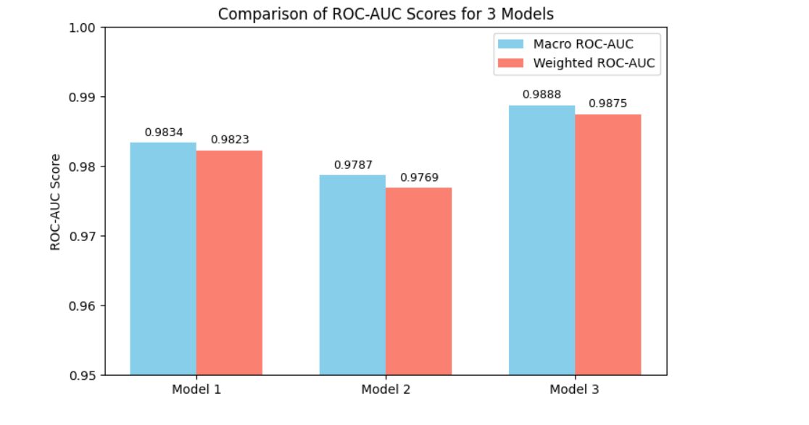
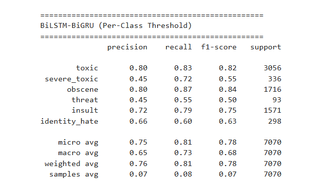
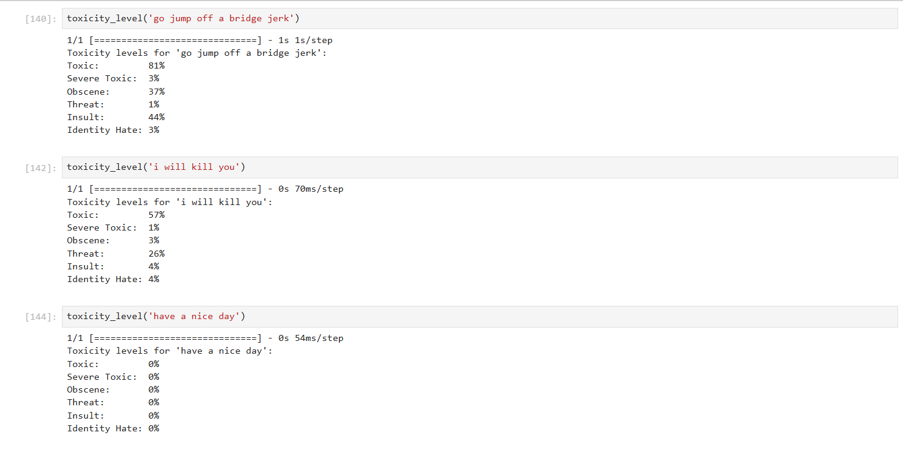
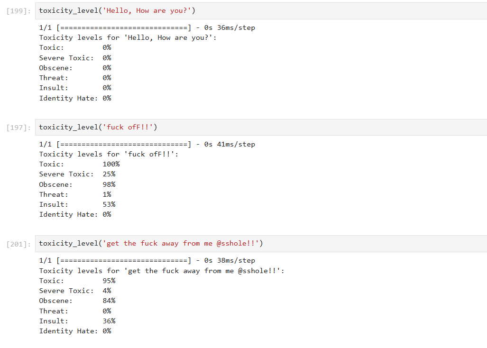
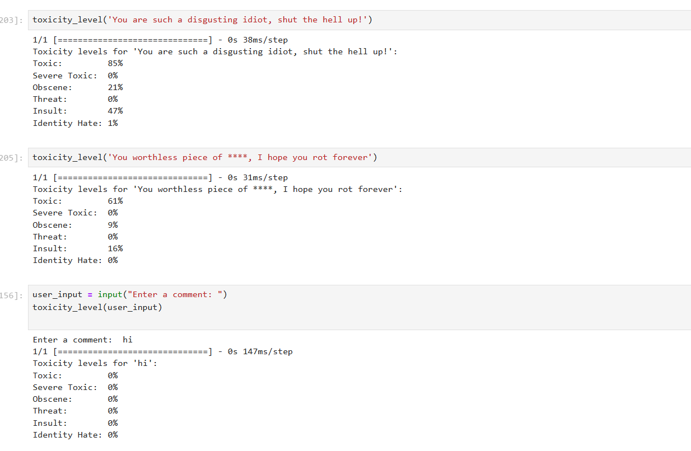
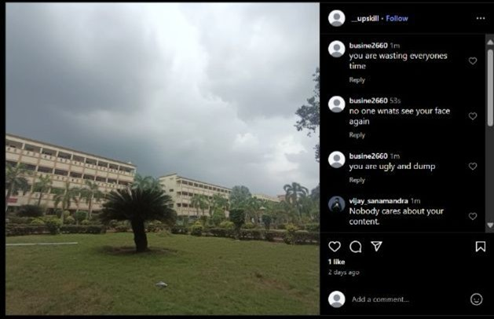

# Toxic Comment Detection Using Deep Learning

## Overview

This project focuses on multi-label toxic comment classification using Deep Learning and Natural Language Processing (NLP) techniques. The system is designed to identify different categories of toxic online comments and support automated moderation workflows for social media and online community platforms.

The project implements and compares multiple deep learning architectures including:

- LSTM
- LSTM-CNN Hybrid
- BiLSTM-BiGRU

The final system predicts toxicity probabilities for six categories:

- Toxic
- Severe Toxic
- Obscene
- Threat
- Insult
- Identity Hate

The project also includes:

- Text preprocessing pipeline
- Lemmatization and stopword removal
- FastText pretrained embeddings
- Per-class threshold optimization
- Multi-label evaluation metrics
- Real-time toxicity prediction examples
- UI-level moderation demonstration

---

# Problem Statement

Online platforms receive massive volumes of user-generated comments every day. Manual moderation becomes difficult due to:

- Large-scale content generation
- Offensive and abusive language
- Hate speech
- Threatening comments
- Identity-based attacks

Traditional keyword-based filtering systems fail to understand contextual toxicity and often generate false positives or false negatives.

This project aims to build an automated toxic comment detection system capable of identifying multiple forms of toxicity using deep learning-based NLP techniques.

---

# Key Features

- Multi-label toxic comment classification
- Detection of six toxicity categories
- Deep learning-based NLP pipeline
- FastText pretrained word embeddings
- Per-class threshold optimization
- Real-time prediction inference
- Toxic comment flagging workflow
- Comparative model evaluation

---

# Dataset Information

## Dataset Used

Jigsaw Toxic Comment Classification Dataset

---

## Basic Dataset Information

| Parameter | Value |
|---|---|
| Train Shape | (159571, 8) |
| Test Shape | (153164, 2) |
| Total Training Comments | 159,571 |
| Total Test Comments | 153,164 |
| Total Comments Overall | 312,735 |

---

## Dataset Columns

- id
- comment_text
- toxic
- severe_toxic
- obscene
- threat
- insult
- identity_hate

---

## Missing Values

### Training Dataset

| Column | Missing Values |
|---|---|
| id | 0 |
| comment_text | 0 |
| toxic | 0 |
| severe_toxic | 0 |
| obscene | 0 |
| threat | 0 |
| insult | 0 |
| identity_hate | 0 |

### Test Dataset

| Column | Missing Values |
|---|---|
| id | 0 |
| comment_text | 0 |

---

## Train / Validation Split

| Split | Samples |
|---|---|
| Training Set | 127,657 |
| Validation Set | 31,914 |
| Split Ratio | 80:20 |

---

## Label Distribution

| Label | Count | Percentage |
|---|---|---|
| toxic | 15,294 | 9.58% |
| severe_toxic | 1,595 | 1.00% |
| obscene | 8,449 | 5.29% |
| threat | 478 | 0.30% |
| insult | 7,877 | 4.94% |
| identity_hate | 1,405 | 0.88% |

---

## Text Length Analysis

| Metric | Value |
|---|---|
| Average Comment Length | 67 words |
| Maximum Length | 1411 words |
| Minimum Length | 1 word |

---

# Data Preprocessing Pipeline

The preprocessing stage was designed to normalize noisy internet text and improve model learning.

## Preprocessing Steps

### Text Normalization

Custom regex-based normalization was implemented to handle:

- Offensive word variations
- Slang forms
- Obfuscated abusive terms
- Repeated characters
- Symbols and special characters

Example:

```text
f@ck → fuck
b!tch → bitch
```

---

### Lowercasing

All comments were converted to lowercase to reduce vocabulary complexity.

---

### Noise Removal

The preprocessing pipeline removed:

- Special characters
- Non-ASCII characters
- Excess spaces
- Numbers
- Unwanted punctuation

---

### Lemmatization

WordNet Lemmatizer was used to convert words into their root forms.

Example:

```text
running → run
hates → hate
```

---

### Stopword Removal

Stopwords and unnecessary low-information tokens were removed to improve semantic quality.

---

# Word Embeddings

The project uses pretrained FastText embeddings for semantic word representation.

Embedding model used:

```text
wiki-news-300d-1M.vec
```

---

## Embedding Configuration

| Parameter | Value |
|---|---|
| Embedding Dimension | 300 |
| Vocabulary Size | 100,000 |
| Sequence Length | 200 |

FastText embeddings were used because they:

- Capture semantic similarity
- Handle subword information
- Improve representation of noisy internet text
- Improve generalization for rare words

---

## Download FastText Embeddings

The FastText embedding file is not included in this repository due to GitHub file size limitations.

Download the pretrained embeddings from:

https://fasttext.cc/docs/en/english-vectors.html

Required file:

```text
wiki-news-300d-1M.vec
```

After downloading, place the file inside your project directory before running the notebook.

---

# Model Architectures

## 1. LSTM Model

| Layer | Configuration |
|---|---|
| Embedding Layer | FastText 300D |
| LSTM Layer | 40 units |
| GlobalMaxPooling1D | Applied |
| Dense Layer | 30 neurons |
| Dropout | 0.1 |
| Output Layer | 6 neurons |

### Activation Functions

- Hidden Layers: ReLU
- Output Layer: Sigmoid

### Loss Function

- Binary Crossentropy

### Optimizer

- Adam

---

## 2. LSTM-CNN Hybrid Model

| Layer | Configuration |
|---|---|
| Embedding Layer | FastText 300D |
| LSTM Layer | 50 units |
| Conv1D | 64 filters |
| Kernel Size | 3 |
| MaxPooling1D | Pool Size 3 |
| Batch Normalization | Applied |
| Dense Layer 1 | 40 neurons |
| Dense Layer 2 | 30 neurons |
| Dropout | 0.2 |
| Output Layer | 6 neurons |

### Activation Functions

- Hidden Layers: ReLU
- Output Layer: Sigmoid

### Loss Function

- Binary Crossentropy

### Optimizer

- Adam

---

## 3. BiLSTM-BiGRU Model (Best Performing Model)

| Layer | Configuration |
|---|---|
| Embedding Layer | FastText 300D |
| Bidirectional LSTM | 60 units |
| Bidirectional GRU | 60 units |
| GlobalMaxPooling1D | Applied |
| Dense Layer 1 | 50 neurons |
| Dense Layer 2 | 40 neurons |
| Dropout | 0.2 |
| Output Layer | 6 neurons |

### Activation Functions

- Hidden Layers: ReLU
- Output Layer: Sigmoid

### Loss Function

- Binary Crossentropy

### Optimizer

- Adam

---

# Hyperparameter Optimization

Talos Grid Search was used for hyperparameter tuning.

## Tuned Parameters

- Number of LSTM units
- Number of GRU units
- Dense layer sizes
- Dropout values
- Batch size
- Activation functions
- Optimizers
- Loss functions

---

# Per-Class Threshold Optimization

Instead of using a fixed threshold of 0.5 for all toxicity categories, the project implemented per-class threshold optimization.

This was necessary because the dataset is highly imbalanced.

Different toxicity classes exhibited different probability distributions, especially minority classes such as:

- threat
- severe_toxic
- identity_hate

The optimal threshold for each class was selected by maximizing the F1-score on the validation set.

---

## Optimized Thresholds (BiLSTM-BiGRU)

| Class | Threshold |
|---|---|
| toxic | 0.35 |
| severe_toxic | 0.25 |
| obscene | 0.25 |
| threat | 0.20 |
| insult | 0.35 |
| identity_hate | 0.40 |

---

# Experimental Results

## ROC-AUC Comparison

| Model | Macro ROC-AUC | Weighted ROC-AUC |
|---|---|---|
| LSTM | 0.9834 | 0.9823 |
| LSTM-CNN | 0.9787 | 0.9769 |
| BiLSTM-BiGRU | 0.9888 | 0.9875 |

---

# ROC-AUC Visualization



---

# Best Model Classification Report

## BiLSTM-BiGRU (Per-Class Threshold)

| Label | Precision | Recall | F1-Score |
|---|---|---|---|
| toxic | 0.80 | 0.83 | 0.82 |
| severe_toxic | 0.45 | 0.72 | 0.55 |
| obscene | 0.80 | 0.87 | 0.84 |
| threat | 0.45 | 0.55 | 0.50 |
| insult | 0.72 | 0.79 | 0.75 |
| identity_hate | 0.66 | 0.60 | 0.63 |

---

## Overall Metrics

| Metric | Score |
|---|---|
| Micro F1-Score | 0.78 |
| Macro F1-Score | 0.68 |
| Weighted F1-Score | 0.78 |

---

# Classification Report Screenshot



---

# Result Interpretation

The project achieved strong ROC-AUC performance across all toxicity categories.

However, the F1-scores for minority labels such as:

- threat
- severe_toxic
- identity_hate

were comparatively lower due to severe dataset imbalance and limited training samples.

Per-class threshold optimization improved:

- Recall
- Minority-class detection
- Macro F1-score
- Overall multi-label classification performance

The BiLSTM-BiGRU model demonstrated the best balance between:

- Precision
- Recall
- Minority-class handling
- Overall classification performance

---

# Real-Time Prediction Examples

The system supports real-time toxicity probability prediction.

---

# Prediction Examples







---

## Example Prediction

```text
Input: "go jump off a bridge jerk"

Toxic: 81%
Obscene: 37%
Insult: 44%
```

The system can identify:

- Toxic comments
- Threatening language
- Obscene content
- Identity-based hate
- Non-toxic comments

---

# Automation and Integration

The project extends beyond standalone model training and demonstrates practical moderation workflow integration.

## Implemented Moderation Features

- Toxic comment flagging
- Toxic content identification
- UI-level moderation demonstration
- Automated toxicity probability prediction
  
---

A prototype moderation interface was integrated with the inference pipeline to simulate real-time toxic comment detection and flagging.


---

# Application-Level Moderation Workflow




---

The UI screenshots demonstrate how toxic comments can be detected and flagged in a simulated social-media-like environment.

This makes the system more practical compared to traditional research-only toxic classification models.

---

# Novelty and Contribution

Although architectures such as LSTM and BiLSTM are widely used in NLP research, this project introduces several practical contributions through integration, optimization, and deployment-oriented design.

## Contributions

- Comparative evaluation of multiple deep learning architectures
- Integration of FastText embeddings for semantic understanding
- Custom preprocessing pipeline for noisy internet text
- Per-class threshold optimization for imbalanced multi-label classification
- Real-time toxicity prediction workflow
- UI-level moderation simulation
- Automated toxic comment flagging mechanism
- End-to-end NLP moderation pipeline

Unlike conventional academic implementations that focus only on model training, this project emphasizes practical moderation-oriented integration and automated toxicity handling.

---

# Technologies Used

## Programming Language

- Python

## Libraries and Frameworks

- TensorFlow
- Keras
- Scikit-learn
- NumPy
- Pandas
- NLTK
- spaCy
- Matplotlib
- Talos

---

# Setup Instructions

## Clone Repository

```bash
git clone https://github.com/eedaratejaswini-07/Toxic_Comment_Detection.git
```

---

## Install Dependencies

```bash
pip install -r requirements.txt
```

---

## Download FastText Embeddings

Download pretrained embeddings from:

https://fasttext.cc/docs/en/english-vectors.html

Required file:

```text
wiki-news-300d-1M.vec
```

Place the embedding file inside the project directory before running the notebook.

---

## Run Notebook

The notebook includes:
- data preprocessing
- deep learning model training
- evaluation metrics
- threshold optimization
- real-time inference examples

  
Open:

```text
DL-NoteBook/ToxicCommentDetection-NoteBook.ipynb
```

and run all cells sequentially.

---

# Project Structure

```text
Toxic_Comment_Detection/
│
├── DL-NoteBook/
│   └── ToxicCommentDetection-NoteBook.ipynb
│
├── DataSet/
│   ├── train.csv
│   └── test.csv
│
├── ScreenShots/
│   ├── Application_toxic_comments.jpg
│   ├── Application_filtered_comments.jpg
│   ├── bilstm_bigru_classification_report.png
│   ├── inference_output_1.png
│   ├── inference_output_2.png
│   ├── inference_output_3.png
│   └── roc_auc_comparison.png
│
├── wiki-news-300d-1M.vec/
│   └── wiki-news-300d-1M.vec
|
├── requirements.txt
├── .gitignore
└── README.md
```

---

# Future Improvements

- Transformer-based architectures (BERT, RoBERTa)
- Real-time API deployment
- Live social media moderation integration
- Explainable AI visualization
- Improved minority-class balancing techniques
- Active learning and continual retraining

---

# Conclusion

This project demonstrates an end-to-end toxic comment detection pipeline using deep learning and NLP techniques.

The system successfully:

- Detects multiple toxicity categories
- Handles multi-label classification
- Uses semantic FastText embeddings
- Applies per-class threshold optimization
- Demonstrates practical moderation integration

Among the evaluated architectures, the BiLSTM-BiGRU model achieved the best overall performance with strong ROC-AUC and balanced F1-score performance.

The project highlights both research-oriented evaluation and practical moderation workflow implementation.
